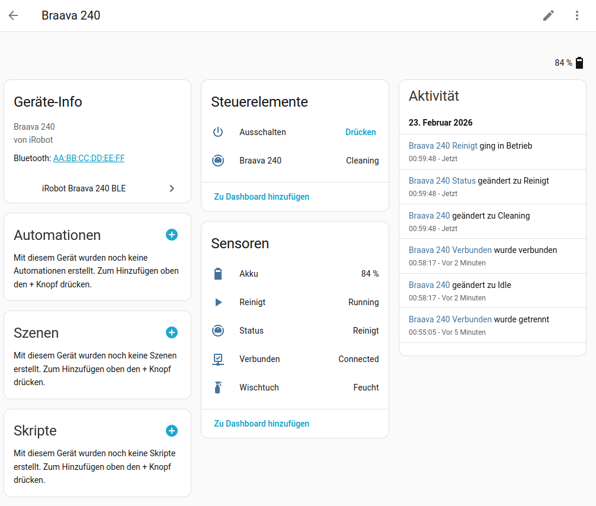

# iRobot Braava 240 BLE – Home Assistant Integration

[](https://github.com/hacs/integration)
[](https://github.com/mtheli/braava_240_ble/releases)
[](LICENSE)

Custom Home Assistant integration to control the iRobot Braava 240 mopping robot via Bluetooth Low Energy (BLE).



## Features

- **Auto-discovery** – The Braava 240 is automatically detected when powered on and within BLE range
- **Start/stop cleaning** – Via the vacuum entity in Home Assistant
- **Cleaning mode** – Normal (full room) or Spot cleaning
- **Battery level** – Calculated from actual charge current (more reliable than the internal raw value)
- **Robot status** – Ready, Cleaning, Error
- **Pad detection** – Shows the currently attached pad type (wet, damp, dry, reusable, etc.)
- **Wetness control** – Per-pad-type wetness levels (Low / Medium / High)
- **Volume control** – Adjustable speaker volume (0–100)
- **Robot name** – Read and change the robot's Bluetooth name
- **Room confinement** – Enable/disable room confinement mode
- **Find robot** – Beep button to locate the robot
- **Device information** – Serial number, firmware version, hardware revision via GATT Device Information Service
- **Power off** – Power-off button to fully shut down the robot (disabled by default)
- **Multilingual** – English and German

## Entities

| Entity | Type | Description |
|--------|------|-------------|
| Braava 240 | Vacuum | Start/stop/locate cleaning |
| Status | Sensor | Robot state (Ready / Cleaning / Error) |
| Battery | Sensor | Battery level in percent |
| Cleaning Pad | Sensor | Detected pad type |
| Connected | Binary Sensor | BLE connection status |
| Cleaning | Binary Sensor | Active cleaning yes/no |
| Cleaning Mode | Select | Normal / Spot |
| Wetness Wet Pad | Select | Wetness level for wet pads |
| Wetness Damp Pad | Select | Wetness level for damp pads |
| Wetness Reusable Wet | Select | Wetness level for reusable wet pads |
| Wetness Reusable Damp | Select | Wetness level for reusable damp pads |
| Volume | Number | Speaker volume (0–100) |
| Name | Text | Robot name (read/write, max 20 characters) |
| Room Confinement | Switch | Room confinement on/off |
| Beep | Button | Trigger an audible beep to locate the robot |
| Reset Wetness | Button | Reset all wetness levels to defaults (Medium) |
| Power Off | Button | Fully shut down the robot (must be manually enabled) |

## Installation

### HACS (recommended)

1. Open HACS in Home Assistant
2. **Integrations** → three-dot menu → **Custom repositories**
3. Enter the repository URL and select **Integration** as the category
4. Install "iRobot Braava 240 BLE"
5. Restart Home Assistant

### Manual

1. Copy the `custom_components/braava_240_ble/` folder into your Home Assistant `config/custom_components/` directory
2. Restart Home Assistant

## Setup

1. Turn on the Braava 240 and place it within BLE range
2. Home Assistant will automatically discover the robot via the Bluetooth integration
3. Click **Configure** in the notification and confirm

If the robot is not discovered automatically:
**Settings** → **Devices & Services** → **Add Integration** → "iRobot Braava 240 BLE"

## Requirements

- Home Assistant 2024.11.0 or newer
- Bluetooth adapter on the Home Assistant host (built-in or USB dongle)
- iRobot Braava 240 (codename "Altadena")

## BLE Protocol

This integration communicates directly with the Braava 240 via BLE — **no cloud service** and **no iRobot account** required. All communication is fully local.

The robot uses a two-layer GATT protocol:

- **Transport layer** – Manages data transfer via two BLE characteristics (command + status)
- **Robot command layer** – The actual commands (query status, start cleaning, etc.) are transferred as packets via a data characteristic

For a detailed technical description of the BLE protocol, see [PROTOCOL.md](PROTOCOL.md).

## Vacuum Card

This integration works with the [Vacuum Card](https://github.com/denysdovhan/vacuum-card) by Denys Dovhan for a visual dashboard experience.

The vacuum entity exposes `start`, `stop` and `locate` (beep) actions, and additional attributes (`pad_type`, `cleaning_mode`, `robot_name`, `runtime_minutes`, `mission_status`, `battery_voltage_v`) that can be used as stats. For translated values, reference the sensor entity directly via `entity_id` instead of using `attribute`.

### Example configuration

```yaml
type: custom:vacuum-card
entity: vacuum.braava_240
battery_entity: sensor.braava_240_battery
image: https://raw.githubusercontent.com/mtheli/braava_240_ble/master/images/braava-jet-240.svg
stats:
  default:
    - attribute: robot_name
      subtitle: Name
    - entity_id: sensor.braava_240_cleaning_pad
      subtitle: Pad
    - attribute: cleaning_mode
      subtitle: Mode
  cleaning:
    - attribute: runtime_minutes
      subtitle: Runtime
      unit: min
    - entity_id: sensor.braava_240_cleaning_pad
      subtitle: Pad
shortcuts:
  - name: Spot
    icon: mdi:target
    service: select.select_option
    service_data:
      entity_id: select.braava_240_cleaning_mode
      option: spot
  - name: Normal
    icon: mdi:map-marker-path
    service: select.select_option
    service_data:
      entity_id: select.braava_240_cleaning_mode
      option: normal
```

## Supported Robot Commands

The Braava 240 firmware exposes 26 robot commands. This integration currently uses 18 of them:

| ID | Command | Status | Description |
|----|---------|--------|-------------|
| 0x00 | NOP | Implemented | No operation (transport layer) |
| 0x01 | GET_WETNESS | Implemented | Query wetness levels for all pad types |
| 0x02 | SET_WETNESS | Implemented | Set wetness level per pad type |
| 0x03 | GET_VOLUME | Implemented | Query speaker volume |
| 0x04 | SET_VOLUME | Implemented | Set speaker volume |
| 0x05 | SET_NAME | Implemented | Set robot name |
| 0x06 | GET_BBK_DATA | – | Lifetime statistics (missions, runtime, errors) |
| 0x07 | GET_ROOM_CONFINE | Implemented | Query room confinement setting |
| 0x08 | SET_ROOM_CONFINE | Implemented | Enable/disable room confinement |
| 0x09 | REMOTE_CONTROL | Implemented | Enable/disable remote control mode |
| 0x0A | JOYSTICK | – | Manual joystick control |
| 0x0B | SPRAY | – | Trigger water spray |
| 0x0C | VIBRATE | Unused | Enable/disable vibration (requires remote control mode) |
| 0x0D | BEEP | Implemented | Trigger audible beep |
| 0x0E | SPOT_CLEAN | Implemented | Start spot cleaning |
| 0x0F | GET_APP_DATA | – | Query mission data (runtime, ending reason) |
| 0x10 | START_CLEAN | Implemented | Start full-room cleaning |
| 0x11 | STOP_CLEAN | Implemented | Stop active cleaning |
| 0x12 | GET_STATUS | Implemented | Query robot state and mission status |
| 0x13 | GET_BATTERY | Implemented | Query battery level and voltages |
| 0x14 | GET_PAD_TYPE | Implemented | Query attached pad type |
| 0x15 | POWER_OFF | Implemented | Power off the robot |
| 0x16 | GET_ROBOT_REGISTERED | – | Check app registration status |
| 0x17 | SET_ROBOT_REGISTERED | – | Set app registration status |
| 0x18 | GET_NAME | Implemented | Query robot name |
| 0x19 | FACTORY_RESET | – | Factory reset the robot |

## License

MIT
